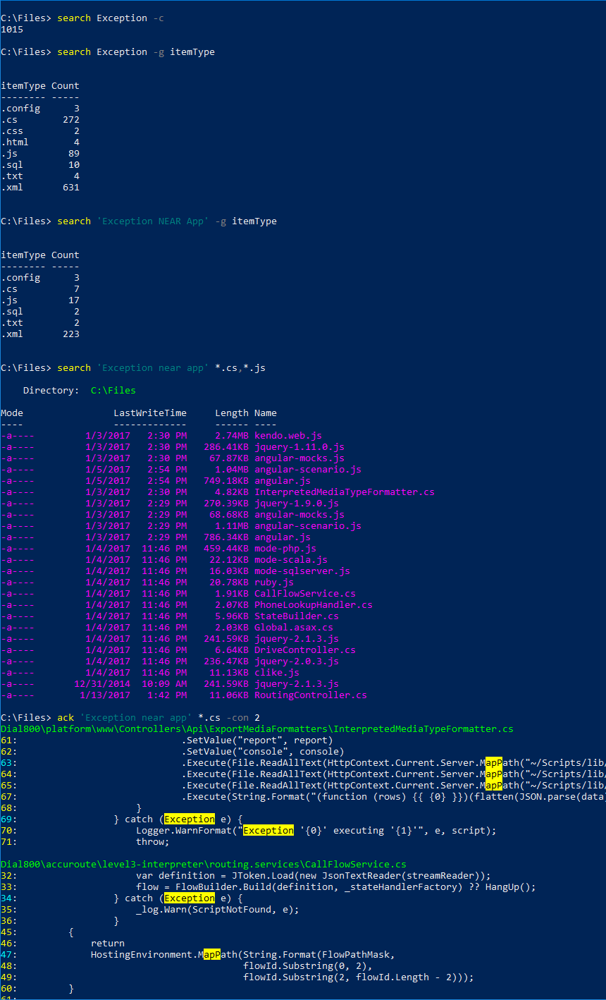

## Search-Index
Queries the Windows Search index, returns FileInfo objects.
```powershell
Search-Index [[-s] <Object>] [[-filePattern] <Object>] [[-path] <String>] [[-directoryPattern] <String>]
[[-top] <Int32>] [-noTraverse] [-query] [-count] [[-groupBy] <String>] [<CommonParameters>]
```
**Aliases:** search

Parameter | Description
----------|------------
s | Keyword, phrase, or advanced search string, e.g.: `"mighty ducks"`, `mighty OR ducks`, `(mighty NEAR ducks) AND "frozen lake"` (see the [CONTAINS Predicate in the Windows Search SQL syntax](https://msdn.microsoft.com/en-us/library/ms691971(v=vs.85).aspx) for additional examples.)
query | Indicates that the `s` parameter should be appended to the WHERE clause as-is allowing you to use multiple CONTAINS, FREETEXT, and/or other criteria, e.g.: `CONTAINS('zip*') AND NOT CONTAINS('zipper')` (see [Windows Search SQL syntax](https://msdn.microsoft.com/en-us/library/ms691985(v=vs.85).aspx) for additional examples.) When `query` is specified the full SQL query is printed in yellow prior to executing to help troubleshoot syntax errors.
filePattern | Filter filename, e.g.: `*.txt`, `*.ps*`, `*.??` (`*` matches one or more, `?` exactly one)
directoryPattern | Filter full path, e.g.: `*user/config*`
path | Limits search to files at or under this location (recursive), defaults to current directory.
noTraverse | Do not traverse subfolders.
top | Limit results.
count | Return just the number of matches found instead of the actual FileInfo objects.
groupBy | Return counts grouped by the specified field, e.g.: `FileExtension`, `FileOwner` (see [Windows Properties](https://msdn.microsoft.com/en-us/library/windows/desktop/bb760699(v=vs.85).aspx) for available fields.) If you combine `groupBy` with `count` the count of distinct groups is returned.


## Search-Files
Searches for patterns in files and displays the results. Reads FileInfo objects from stdin or hits the filesystem with the specified path and file pattern. When Search-Files is used without an input stream it detects and skips binary files.
```powershell
Search-Files [[-pat] <String>] [[-file] <Object>] [[-path] <String>] [[-context] <Int32[]>]
[-caseSensitive] [-noTraverse] [-simple] [<CommonParameters>]
```
**Aliases:** *none*

Parameter | Description
----------|------------
pat | Pattern for which to search and highlight. Assumed to be a regex unless `simple` is specified.
caseSensitive | Indicates that the `pat` should also match casing.
simple | Indicates that `pat` should be interpreted as a literal string and not a regex.
file | Filter for filename, e.g.: `*.txt` (an array can be provided `*.txt,*.cs`) defaults to `*`. This parameter is ignored when an input stream is provided.
path | Path to scan for files (recursive), defaults to current directory. This parameter is ignored when an input stream is provided.
noTraverse | Do not traverse subfolders.
context | Context lines to be included in output, e.g.: `0,4` (0 before and 4 after), defaults to `3` (3 before and 3 after).


## Search-Text
Pipes `Search-Index` to `Search-Files` and derives a regular expression from the search string to use for matching and highlighting. When `Search-Index` returns nothing for any reason (the path is not indexed, or the index is unavailable, etc.) `Search-Files` will fallback on scanning the filesystem itself, so you can use `Search-Text` regardless of the indexed status of your files and still get results. A warning is printed out when there is nothing indexed below the specified path.
```powershell
Search-Text [[-s] <Object>] [[-filePattern] <Object>] [[-path] <String>] [[-directoryPattern] <String>]
[[-top] <Int32>] [[-context] <Int32[]>] [-noTraverse] [-query] [<CommonParameters>]
```
**Aliases:** ack

Parameter | Description
----------|------------
s | `s` parameter for `Search-Index` (an appropriate regex is derived from this and passed to `Search-Files`).
filePattern | `filePattern` parameter for `Search-Index` and `file` parameter for `Search-Files`.
directoryPattern | `directoryPattern` parameter for `Search-Index` and `path` parameter for `Search-Files`.
path | `path` parameter for `Search-Index` and `Search-Files`.
top | `top` parameter for `Search-Index`, this has no effect in the case of fallback to filesystem.
noTraverse | `noTraverse` for `Search-Index` and `Search-Files`.
query | `query` parameter for `Search-Index`, this has no effect in the case of fallback to filesystem.

## Get-IndexedPaths
Lists all locations in the Windows Search index at or below the specified path.
```powershell
Get-IndexedPaths [[-path] <String>] [<CommonParameters>]
```
**Aliases:** index

Parameter | Description
----------|------------
path | Path to search, defaults to current directory.


## usage examples

(colorization of FileInfo objects is from [PsColor](https://github.com/Davlind/PSColor))

## installation
from [PowerShell Gallery](https://www.powershellgallery.com/packages/PsSearch) (requires Powershell V5 or Win10)..
```powershell
Install-Module PsSearch
```
manually..
```powershell
ni "$(($env:PSModulePath -split ';')[0])\PsSearch\PsSearch.psm1" -f -type file -value (irm "https://raw.githubusercontent.com/gfody/PowershellModules/master/PsSearch/PsSearch.psm1")
```


